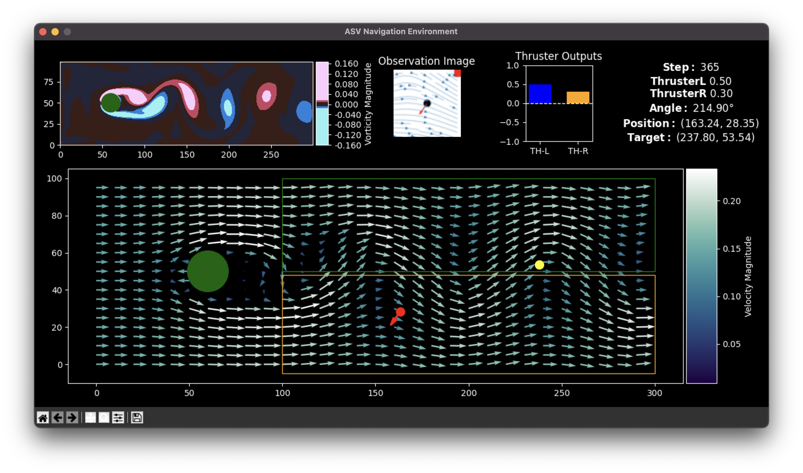

khalasi : Energy Efficient Navigation for ASVs in Turbulent Vortical Fields 🌊

---

**about the project:**

This project aims to develop a **Deep Reinforcement Learning (DRL)** strategy for achieving **energy-efficient navigation** of an underactuated **Autonomous Surface Vehicle (ASV)** in dynamic and unpredictable environments, with a particular focus on **vortical fields**. The main goal is to optimize the ASV’s movement with minimal actuation, primarily utilizing **thrust-based controls**, while exploiting environmental factors such as **turbulence** and **vortices** to improve navigation performance and efficiency.

---

**training-testing env:**

**further info:**

- Uses Gym + Stable Baselines for RL environment setup.
- Employs a JAX-based Von-Karman Street simulation for flow-field generation, enabling faster training.
- TensorBoard integrated for model performance and reward tracking.

---

